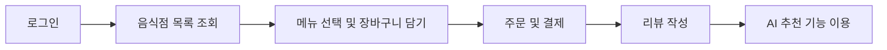
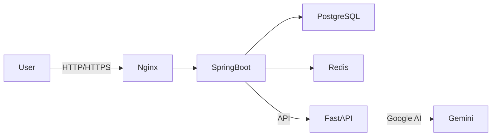

# babgo-project
BabGO — AI-powered food delivery project by Team Meal Is Here

## 목차
- [팀원 소개](#팀원-소개)
- [프로젝트 개요](#프로젝트-개요)
- [주요 기술 스택](#주요-기술-스택)
- [프로젝트 설계](#프로젝트-설계)
   - [PRD](#prd)
   - [ERD](#erd)
   - [API](#api)
   - [시스템 구성도](#시스템-구성도)
   - [아키텍쳐](#아키텍쳐)
   - [프로젝트 구조 & 컨벤션](#프로젝트-구조--컨벤션)
- [트러블슈팅](#트러블슈팅)
- [프로젝트 성과](#프로젝트-성과)

## 팀원 소개
<div align="center">
  <table>
    <tbody>
      <tr>
        <td align="center" style="padding: 20px;">
          
          <div style="margin-top: 10px; font-size: 14px; line-height: 1.2;">
            <b>리더</b><br />
            <a href="https://github.com/dain391" style="font-size: 16px;">이다인</a>
            <div style="margin-top: 5px; font-size: 14px;">
              <br />프로필<br />리뷰<br />좋아요/즐겨찾기
            </div>
          </div>
        </td>
        <td align="center" style="padding: 20px;">
          
          <div style="margin-top: 10px; font-size: 14px; line-height: 1.2;">
            <b>부리더</b><br />
            <a href="https://github.com/Hojeong016" style="font-size: 16px;">채호정</a>
            <div style="margin-top: 5px; font-size: 14px;">
              <br />주문<br />결제<br /><br />
            </div>
          </div>
        </td>
        <td align="center" style="padding: 20px;">
          
          <div style="margin-top: 10px; font-size: 14px; line-height: 1.2;">
            <b>팀원</b><br />
            <a href="https://github.com/maengjjin" style="font-size: 16px;">김명진</a>
            <div style="margin-top: 5px; font-size: 14px;">
              <br />검색<br /><br /><br />
            </div>
          </div>
        </td>
        <td align="center" style="padding: 20px;">
          
          <div style="margin-top: 10px; font-size: 14px; line-height: 1.2;">
            <b>팀원</b><br />
            <a href="https://github.com/minsoo-hub" style="font-size: 16px;">나민수</a>
            <div style="margin-top: 5px; font-size: 14px;">
              <br />음식점<br /><br /><br />
            </div>
          </div>
        </td>
        <td align="center" style="padding: 20px;">
          
          <div style="margin-top: 10px; font-size: 14px; line-height: 1.2;">
            <b>팀원</b><br />
            <a href="https://github.com/upotato200" style="font-size: 16px;">박상원</a>
            <div style="margin-top: 5px; font-size: 14px;">
              <br />인증/인가(JWT)<br /><br /><br />
            </div>
          </div>
        </td>
        <td align="center" style="padding: 20px;">
          
          <div style="margin-top: 10px; font-size: 14px; line-height: 1.2;">
            <b>팀원</b><br />
            <a href="https://github.com/hello22433" style="font-size: 16px;">이세준</a>
            <div style="margin-top: 5px; font-size: 14px;">
              <br />AI<br />메뉴<br />CI/CD<br />
            </div>
          </div>
        </td>
      </tr>
    </tbody>
  </table>
</div>

## 프로젝트 개요
> **개발 기간**: 2025. 09. 26 ~ 2025. 10. 19<br />
- `BabGO`는 AI 추천 기반 배달 플랫폼입니다.
- 음식점들의 배달 주문 관리, 결제, 그리고 주문 내역 관리 기능 등을 제공합니다.

### 사용자 이용 흐름


## 주요 기술 스택
<div align="center">

### **애플리케이션**


### **인증 및 보안**
 
 

### **데이터베이스**


### **빌드 도구**


### **CI/CD**


### **협업 도구**


 

</div>

## 프로젝트 설계

### PRD
- [PRD](https://www.notion.so/teamsparta/PRD-27a2dc3ef5148030a3b3f6019323f4fb?source=copy_link)
- [기능명세서](https://www.notion.so/teamsparta/27a2dc3ef5148022865aca7b9dfabb0c?source=copy_link)

### ERD
[](https://www.erdcloud.com/d/jHNxpohBm4RnPtPXX)

### API
- [API Documentation](https://www.notion.so/teamsparta/2372dc3ef514817b8c26c6c58d9dca74?v=2372dc3ef5148125af94000c7b0d96b6&source=copy_link)

### 시스템 구성도


### 아키텍쳐
[]()

### 프로젝트 구조 & 컨벤션
```text
com.babgo.[domain]
├─ application
│  ├─ facade                # 유스케이스(트랜잭션 경계, 조합/흐름)
│  └─ info                  # 유스케이스 I/O DTO (내부 교환 전용)
│
├─ controller
│  ├─ ApiController         # HTTP 경계 (검증, 변환, 호출 위임)
│  ├─ request               # HTTP 요청 DTO
│  └─ response              # HTTP 응답 DTO
│
├─ domain
│  ├─ model                 # 엔티티/값객체 (불변식, 상태 전이)
│  ├─ service               # 도메인 서비스(순수 규칙/계산/협력)
│  ├─ event                 # 도메인 이벤트 (OrderCreated 등)
│  └─ repository            # Port 인터페이스 (도메인 관점)
│
└─ repository
   ├─ JpaRepository         # Spring Data JPA 인터페이스
   └─ repositoryImpl        # Port 구현체(infra adapter, JPA↔Domain 매핑)
```

<details>
<summary> 규칙 요약 및 코드 컨벤션</summary>


---

### ▫️ 규칙 요약

| 영역 | 설명 | 허용 | 제한 |
|------|------|------|------|
| **controller** | HTTP 요청/응답 처리 계층. 변환·검증·위임만 담당 | - DTO 변환을 통한 Facade 호출<br>- ApiController 사용 | - 비즈니스 로직 직접 호출 금지<br>- Facade 외 계층 의존 금지 |
| **application** | 유스케이스 조합 계층. 트랜잭션 경계, 도메인 서비스 호출 | - Facade<br>- Info DTO<br>- @Transactional<br>- 도메인 서비스/엔티티 직접 소통 허용<br>  (도메인 전용 DTO 미사용) | - 비즈니스 규칙 직접 수행 금지 |
| **domain** | 핵심 로직 계층. 엔티티/값객체/도메인 서비스 | - JPA 영속성 어노테이션 사용 허용<br>- 도메인 이벤트 발행<br>- VO/Enum 사용<br>- 생성자 불변성 검증<br>- 상태 변경은 도메인 메서드로만 수행 | - DTO 의존 금지<br>- Setter 사용 금지<br>- 외부 인프라 직접 호출 금지 |
| **repository** | 인프라 계층. DB·외부 연동 | - JPA<br>- 구현체(Impl)에서 데이터 저장/조회 처리 | - 도메인에서 JPA 직접 의존 금지 |
| **global** | 전역 공통 기능 (Exception, Util 등) | - CustomException<br>- ErrorType<br>- 공통 유틸 | - 도메인 특화 로직 |


---

### ▫️ 네이밍 규칙

| 구분 | 규칙 | 예시 |
|------|------|------|
| **변수/메서드** | `camelCase` | `createUser`, `likeCount` |
| **클래스/인터페이스** | `PascalCase` | `UserServiceImpl`, `UserRepository`, `ApiResponse` |
| **단건 조회 메서드** | `getUser{}` | `getUserById` |
| **다중 조회 메서드** | `get{ }s` | `getUsers`, `getOrders` |
| **전체 조회 메서드** | `getAll{}` | `getAllProducts` |
| **생성 메서드** | `create{}` | `createUser` |
| **수정 메서드** | `update{}` | `updateOrder` |
| **삭제 메서드** | `delete{}` | `deleteComment` |
| **취소 메서드** | `cancel{}` | `cancelPayment` |
| **DB 관련** | JPA 네이밍 규칙 준수 | `findByEmail`, `existsByNickname` |

---

### ▫️ DTO 규칙

- **Controller DTO** → `Request`, `Response`
- **Application DTO** → `Info`
- **Entity 클래스** → 도메인명 그대로 사용
- **Repository 네이밍**
  - 도메인: `UserRepository`
  - JPA: `UserJpaRepository`
  - 구현체: `UserRepositoryImpl`

---

### ▫️ 추가 규칙

- **공통 응답**: `ApiResponse.success()`, 예외는 `CustomException`으로 처리
- **비밀 키 관리**: `.env` 사용 (`.gitignore` 등록 필수)
- **코드 스타일**:
  - 어노테이션은 길이 짧은 것부터 정렬합니다.
  - `setter`, `@Data` 지양합니다.
  - DTO → 내부(static) 클래스 사용, 모든 필드는 final로 선언하여 불변성을 보장합니다.
- **엔티티 / 값 객체**
  - **생성자 불변성**: 생성자에서 모든 필드 검증을 수행하여.  
    비즈니스 로직에서 객체를 호출할 때는 이미 완전하고 일관된 상태임을 보장합니다.
  - 팩토리 메서드(`of`)를 통해서만 생성을 허용합니다.
  - Setter 사용 지양 합니다. 상태 변경은 도메인 메서드를 통해 수행합니다.
</details> 

## 트러블슈팅

<details>
<summary>1. </summary>

- **문제**
   -  
- **원인**
   - 
- **해결**
   - 
</details>

## 프로젝트 성과
- 도메인 주도 설계(Domain Layer / Application Layer 분리)
- 트랜잭션 경계 명확화 (Facade 패턴 적용)
- JWT 기반 인증/인가 완성
- QueryDSL 기반 검색 필터 구현
- Google Gemini API 연동으로 AI 설명 자동 생성
- GitHub Actions + Docker 기반 CI/CD 파이프라인 구축
